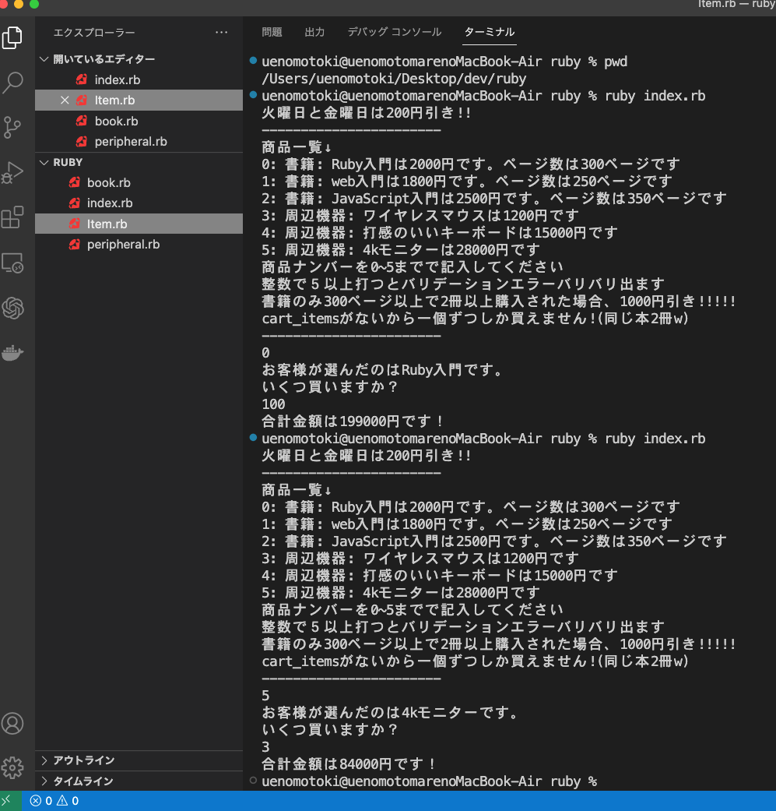

### 2023 年 04/02(日)

## 取り組んだ課題

- Progate 学習：　プログラミングに触れてみる
  - Ruby || ~ Ruby V

## わかったこと

- Ruby|||で return に関することがいまいちわかってないところがあったが今回の復習のおかげで理解が深まりました
- Ruby V では何となく使っていたクラスやインスタンス変数などの理解が深まった
- クラスが設計図でインスタンス変数が物

## 次やること

- プロゲートの SQL

## 感想

- ER 図でいうクラスが Entity でインスタンスが Attribute みたいな感じかなちょっと違うと思いますが。
- プロゲートサクッと終わらすつもりでしたが結構勉強になるので指定されたものフルコンプリートしたいと思います

### 自分なりに Ruby V でやったことを条件を変えてアレンジしてアウトプットしました。

https://github.com/uenomoto/ruby-class

- 

## 勉強時間

Today: 8h

Total: 10h
